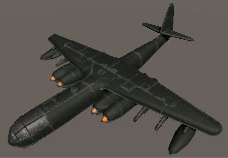
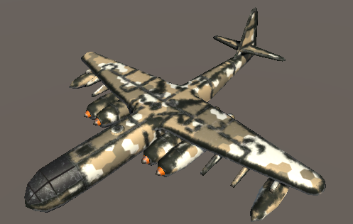
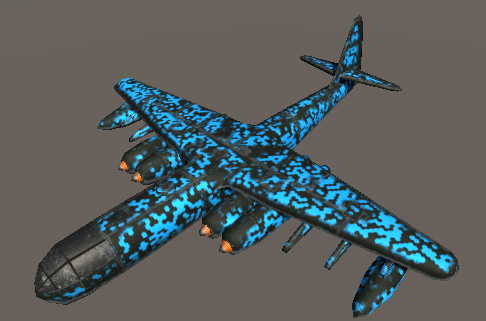
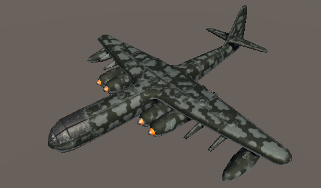

# Camouflage Shader

A (Unity) surface shader made to apply camo over any existing model.

Includes additive and blend shader.

Extra: 
RGB Shader - Split your camo into 3 b/w textures, set color for each one - full customization.

Plane by Chappi:
https://www.artstation.com/adriank
https://sketchfab.com/adriank

# Usage

The shader supports:
    
    - Albedo Texture
    - Normal Map
    - Metallic Map
    - Smoothness Slider

This shader requires:
    
    - Camo Mask (B/W, defines where camo is rendered)
    - Camo Texture (B/W and Multiplied by Color or Colored Texture)

This shader allows you to:

    - Set camo scale
    - Set camo location
    - Set camo color

# Check "Releases" tab for an executable demo

### Before Camo

### After Camo

 
